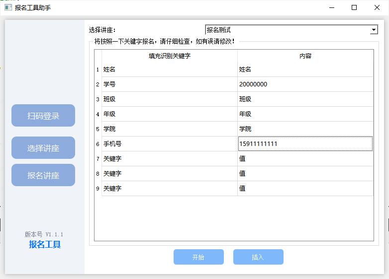
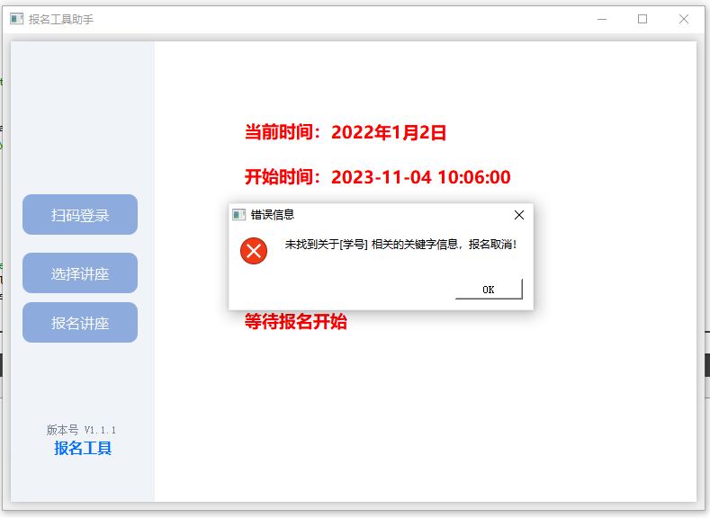
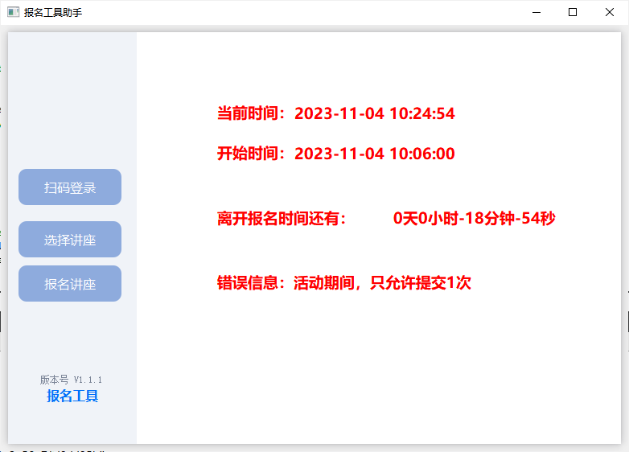
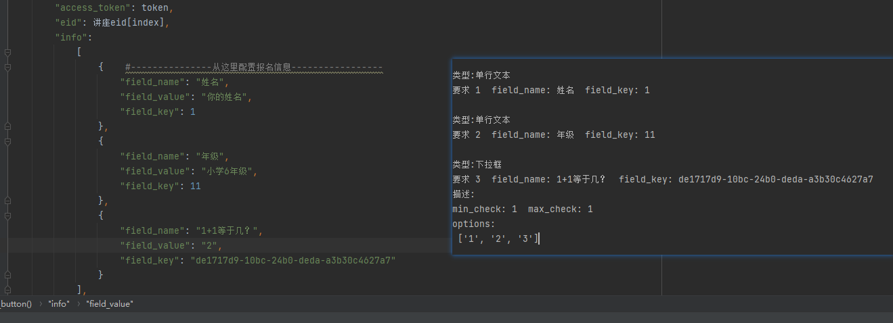
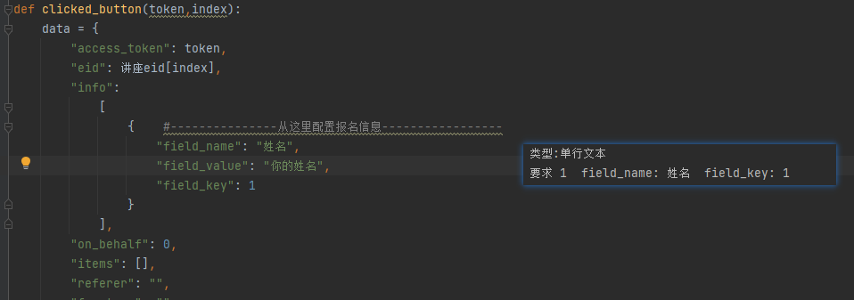
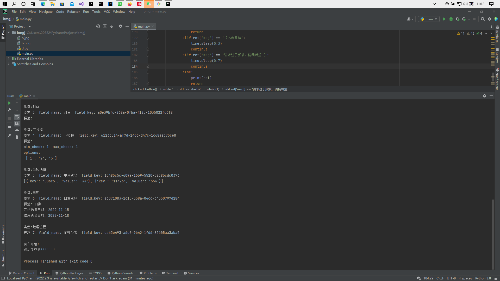

# 微信小程序报名工具抢活动脚本

## 介绍
微信小程序报名工具辅助工具，python脚本已失效请使用程序，如程序有问题或者不会使用等问题发邮件询问(guanlinbo@88.com)。

$\color{red}{注意，本程序只是辅助报名讲座工具，并不能百分之一百抢到讲座!}$

## 程序原理
报名的数据主要是获取你在小程序上存的数据也就是快速填写的数据，报名前两秒才能获取到具体的报名内容，程序获取到报名内容然后跟你的数据对比，没问题的话就帮你报名。如果某个选项内容在你的数据里面没有而讲座支持报名后修改数据就会自动帮你填写数据报名，默认是选项的名字，不支持的话会弹个框让你填数据或者弹个下拉框让你选，主要看要填的内容类型是什么，这种的话如果你速度快点也比你手机上抢快点，起码页面不会刷新不出来。

## 使用说明

### 软件程序

- 软件下载链接：https://wwzv.lanzouu.com/i9oWO1i9u05e

解压缩 然后双击`bmgj.exe`文件

### 软件设置界面

### 扫码界面

### 填写报名信息和选择讲座

说明：这些信息都是可以修改和增加的，请根据以往讲座需要的信息进行填写，支持单选，不支持多选！

### 信息提示页面

<!-- ### 信息缺失界面
 -->

### 报名成功界面

### 报名失败
报名失败的话会显示失败原因

<!-- ## python脚本
如选择单文件脚本需先配置好文件内 **(122行)** 配置如学号，班级等
运行前程序会输出讲座所要求的信息，如跟本配置一致无需修改，如不是请配置好，不然会抢购失败!

### 演示

### 注意
要是程序不显示讲座信息，请先在微信上点击一下讲座，看看`报名工具小程序我的记录`有没有此讲座信息

$\color{FF0000}{如不确定配置是不是按要求填写了可以在微信小程序报名工具创建一样活动然后测试一下}$ -->