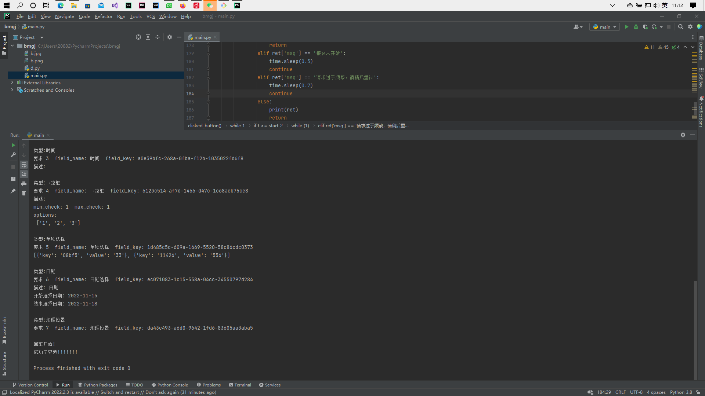

# 微信小程序报名工具抢活动脚本

#### 介绍
微信小程序报名工具抢活动脚本，包含单python文件和gui程序

#### 使用说明
如选择单文件脚本需先配置好文件内 **(122行)** 配置如学号，班级等
运行前程序会输出讲座所要求的信息，如跟本配置一致无需修改，如不是请配置好，不然会抢购失败!

### 演示

### 注意
要是程序不显示讲座信息，请先在微信上点击一下讲座，看看`报名工具小程序我的记录`有没有此讲座信息

$\color{FF0000}{如不确定配置是不是按要求填写了可以在微信小程序报名工具创建一样活动然后测试一下}$
